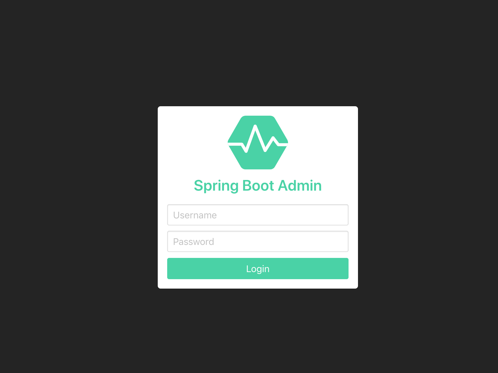
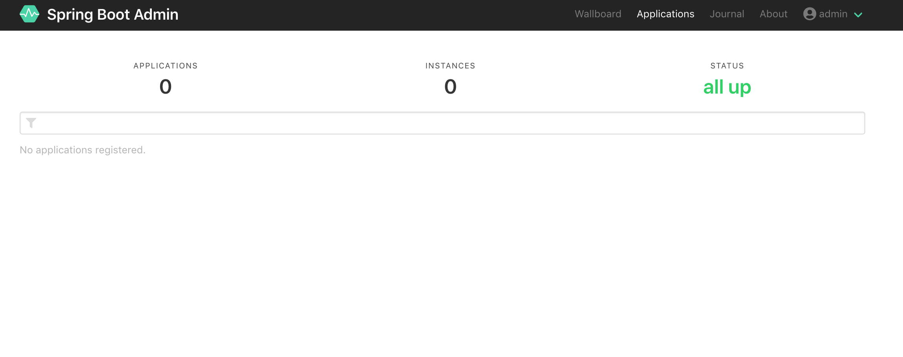
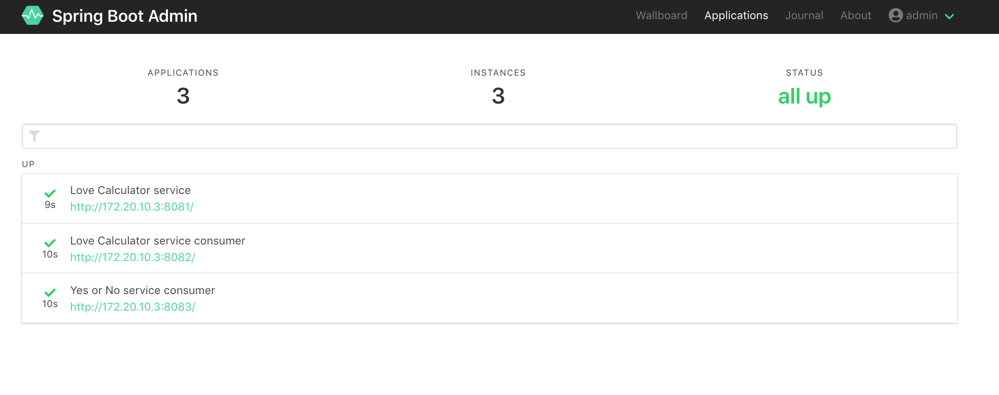
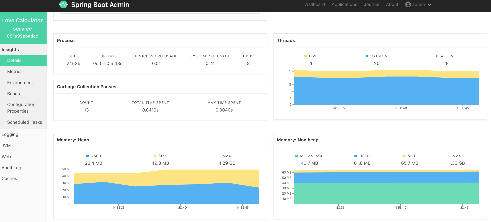
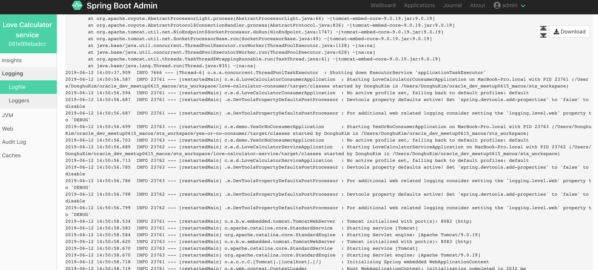
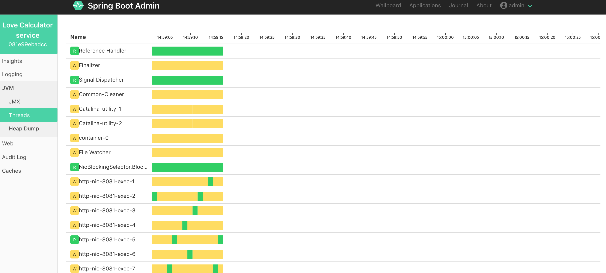

# 실습1: Microservice Monitoring with Spring Boot Admin

[2019.06.15] Oracle Developer Meetup Hands-On 문서

***

### 실습 목표

Spring Boot 마이크로 서비스를 Spring Boot Admin을 사용하여 Metrics 모니터링

***

### Spring Admin Server (Spring Boot 프로젝트) 생성 및 구성
제공된 Eclipse Spring Tool Suite(이하 STS) 프로젝트중에서 spring-admin-server가 Spring Boot Admin (모니터링 서버) 역할을 합니다. 

제공되는 프로젝트를 활용해도 되지만, 새로 만들어볼 수 있습니다. 새로 프로젝트를 생성해서 Spring Boot Admin을 구성할 경우 아래 **Spring Boot Admin 서버 생성**을 클릭해서 가이드데로 진행합니다.

<details>
<summary>Spring Boot Admin 서버 생성</summary>
<div markdown="1">
1. STS에서 File > New > Spring Starter Project를 선택 (안보일 경우 Other 클릭 후 검색)


2. Name과 Java Version을 다음과 같이 입력 후 Next > Finish 클릭
* Name
    * spring-admin-server-2
* Java Version 
    * 12

3. STS에서 pom.xml에 Dependency 설정을 합니다. 좌측 STS Package Explorer에서 **spring-admin-server-2/pom.xml** 파일을 더블 클릭하고 다음과 같이 기존 설정된 내용에 아래 properties, dependencies, dependencyManagement까지의 내용으로 변경하고 저장(Ctrl + s)합니다.
> Eclipse STS에서 XML에 대한 자동 포맷팅 단축키는 ***'Ctrl + Shift + f'*** 입니다.

```xml
<properties>
    <java.version>12</java.version>
    <spring-boot-admin.version>2.1.5</spring-boot-admin.version>
    <spring-cloud.version>Greenwich.RELEASE</spring-cloud.version>
</properties>

<dependencies>
    <dependency>
        <groupId>org.springframework.boot</groupId>
        <artifactId>spring-boot-starter</artifactId>
    </dependency>
    
    <dependency>
        <groupId>org.springframework.boot</groupId>
        <artifactId>spring-boot-starter-test</artifactId>
        <scope>test</scope>
    </dependency>

    <dependency>
        <groupId>org.springframework.boot</groupId>
        <artifactId>spring-boot-starter-web</artifactId>
    </dependency>

    <dependency>
        <groupId>org.springframework.boot</groupId>
        <artifactId>spring-boot-devtools</artifactId>
        <optional>true</optional>
    </dependency>

    <dependency>
        <groupId>de.codecentric</groupId>
        <artifactId>spring-boot-admin-starter-server</artifactId>
    </dependency>

    <dependency>
        <groupId>org.springframework.boot</groupId>
        <artifactId>spring-boot-starter-security</artifactId>
    </dependency>
</dependencies>

<dependencyManagement>
    <dependencies>
        <dependency>
            <groupId>de.codecentric</groupId>
            <artifactId>spring-boot-admin-dependencies</artifactId>
            <version>${spring-boot-admin.version}</version>
            <type>pom</type>
            <scope>import</scope>
        </dependency>
        <dependency>
            <groupId>org.springframework.cloud</groupId>
            <artifactId>spring-cloud-dependencies</artifactId>
            <version>${spring-cloud.version}</version>
            <type>pom</type>
            <scope>import</scope>
        </dependency>
    </dependencies>
</dependencyManagement>
```

4. STS에서 Spring Boot Application 파일(spring-admin-server-2/src/main/java/com/example/demo/SpringAdminServer2Application.java)을 열고 다음과 같이 @EnableAdminServer 을 추가합니다.

> STS에서 자동 Package Import 단축키는 ***'Ctrl + Shift + o'***입니다. Annotation을 추가하고 위 단축키를 눌러서 관련 패키지를 임포트 합니다.

```java
@SpringBootApplication
@EnableAdminServer
public class SpringAdminServerApplication {

	public static void main(String[] args) {
		SpringApplication.run(SpringAdminServerApplication.class, args);
	}
}
```

5. main 함수 아래에 Spring Security 관련 설정을 합니다. 다음과 같이 main 함수 아래에 코드를 추가하고 마찬가지로 ***'Ctrl + Shift + o'***을 눌러서 관련 패키지를 임포트합니다.

> Spring Boot Admin에 Spring Seurity 설정을 하게되면, 인증을 통해 Console에 접속할 수 있게 됩니다. 설정을 하지 않을 경우 인증 없이 Spring Boot Admin Console에 인증없이 접속됩니다. 여기서는 간단히 Spring Security를 적용합니다.

```java
public static void main(String[] args) {
    SpringApplication.run(SpringAdminServerApplication.class, args);
}

@Configuration
public class SecurityConfig extends WebSecurityConfigurerAdapter {

    @Override
    protected void configure(HttpSecurity http) throws Exception {
        SavedRequestAwareAuthenticationSuccessHandler successHandler 
            = new SavedRequestAwareAuthenticationSuccessHandler();
        successHandler.setTargetUrlParameter("redirectTo");
        successHandler.setDefaultTargetUrl("/");

        http.authorizeRequests()
            .antMatchers("/assets/**").permitAll()
            .antMatchers("/login").permitAll()
            .anyRequest().authenticated().and()
            .formLogin().loginPage("/login")
            .successHandler(successHandler).and()
            .logout().logoutUrl("/logout").and()
            .httpBasic().and()
            .csrf()
            .csrfTokenRepository(CookieCsrfTokenRepository.withHttpOnlyFalse())
            .ignoringAntMatchers(
                "/instances",
                "/actuator/**"
                );
    }
}
```

6. STS에서 Spring Boot Properties(spring-admin-server-2/src/main/resources/application.properties) 파일에 다음과 같이 추가합니다. 

> 다음 실습에서 Eureka와 연결할 때 사용하는 Property도 미리 추가해서 주석처리 했습니다. 이 부분은 Eureka와 Spring Boot Admin 연결을 위해 사용됩니다. 여기서는 간단히 Spring Boot Admin 어플리케이션의 이름과 포트, 로깅과 Spring Security에 대한 부분만 활성화 했습니다.

```properties
spring.application.name=Boot-Admin
server.port=8090

# Logging
logging.level.org.springframework=INFO
logging.file=./logs/spring-boot-logging.log

# spring security
spring.security.user.name=admin
spring.security.user.password=admin

# for ignore this sba at eureka
#spring.boot.admin.discovery.ignored-services=boot-admin

# Eureka
#eureka.client.service-url.defaultZone=http://localhost:8761/eureka/
#eureka.client.registry-fetch-interval-seconds=5
#eureka.client.register-with-eureka=true
#eureka.client.fetch-registry=true
#eureka.instance.lease-renewal-interval-in-seconds=10
#eureka.instance.metadata-map.startup=${random.int}
```

7. Spring Boot Admin Server를 시작합니다. Windows Command 또는 Terminal을 열고 다음과 같이 실행합니다.

```
$ cd {ROOT}/sts_workspace/spring-admin-server-2

$ mvn spring-boot:run
```

> 서버 종료는 ***Ctrl + c***로 종료합니다.

8. Browser에서 http://localhost:8090으로 Spring Boot Admin Console에 접속합니다.  
ID/PW : admin/admin




</div>
</summary>
</details>

### Love Calculator 서비스 구성
3개 서비스(love-calculator-service, love-calculator-cconsumer, yes-or-no-consumer)에 대한 Spring Boot Admin에 등록할 클라이언트 설정을 합니다. 3개 서비스 모두 과정이 동일하며, 여기서는 love-calculator-service를 예로 진행합니다. (3개 서비스 모두 적용)

여기서 설정할 파일은 pom.xml과 application.properties 파일입니다.

1. STS에서 love-calculator-service/pom.xml 파일을 열고 **spring-boot-devtools** dependency 하위에 **spring-boot-admin-starter-client**와 **spring-boot-starter-actuator** Dependency를 추가합니다. 
> 실습 편의상 spring-boot-admin.version 버전과 spring-cloud.version 버전관리를 위한 properties 요소와 dependencyManagement 요소는 사전에 미리 추가되었습니다.

```xml
....

    <artifactId>spring-boot-devtools</artifactId>
    <optional>true</optional>
</dependency>

<dependency>
    <groupId>de.codecentric</groupId>
    <artifactId>spring-boot-admin-starter-client</artifactId>
</dependency>

<dependency>
    <groupId>org.springframework.boot</groupId>
    <artifactId>spring-boot-starter-actuator</artifactId>
</dependency>
```

2. STS에서 love-calculator-service/src/main/resources/application.properties를 열고 다음과 같이 Actuator와 Spring Boot Admin Property를 주석 해제합니다.

```properties
spring.application.name=Love Calculator service
server.port=8081

# Logging
logging.level.org.springframework=INFO
logging.file=./logs/spring-boot-logging.log

# Actuator
management.endpoints.web.exposure.include=*

# Spring Boot Admin
spring.boot.admin.client.url=http://localhost:8090
spring.boot.admin.client.username=admin
spring.boot.admin.client.password=admin

# Eureka
#eureka.client.service-url.defaultZone: http://localhost:8761/eureka

# Consul
#spring.cloud.consul.host=localhost
#spring.cloud.consul.port=8500
```

3. 동일하게 나머지 두개의 서비스 (love-calculator-consumer, yes-or-no-consumer)도 동일하게 적용합니다.

### Spring Boot Admin 서버와 Love Calculator 서비스 시작

1. Spring Boot Admin 서버가 내려가 있다면 다시 시작 합니다. 위에서 새로 Spring Boot Admin을 생성했다면, spring-admin-server-2 폴더로 이동해서 시작하면 됩니다.

    ```
    $ cd {ROOT}/sts_workspace/spring-admin-server

    $ mvn spring-boot:run
    ```

2. Love Calculator 서비스를 시작합니다. 편의상 제공된 스크립트로 시작합니다.

* **Windows**
    ```
    cd {ROOT}\sts_workspace

    start_all_svc.cmd
    ```

* **macOS**
    ```
    cd {ROOT}\sts_workspace

    ./start_all_svc.sh
    ```

### 모니터링 화면 확인
브라우저에서 http://localhost:8090 로 접속 후 (id/pw: admin/admin)










***

* [실습2: Microservice Monitoring with Service Discovery (Eureka) and Spring Boot Admin](HOL-PART2.md)

* [첫 페이지로 가기](README.md)

***

### 참고
본 실습 관련 좀 더 상세한 내용은 아래 블로그 참고하세요.
* https://mangdan.github.io/spring-boot-microservice-monitoring-1/