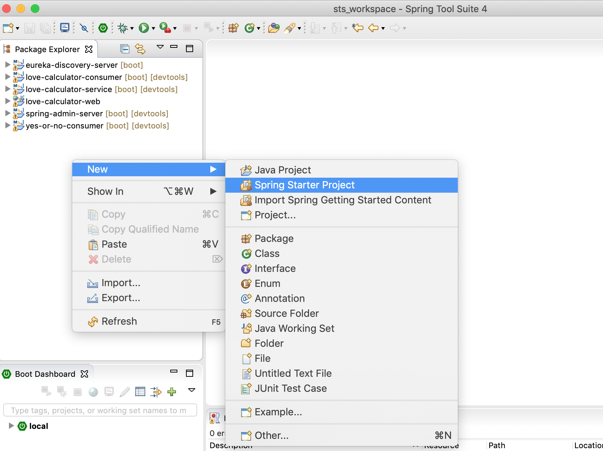
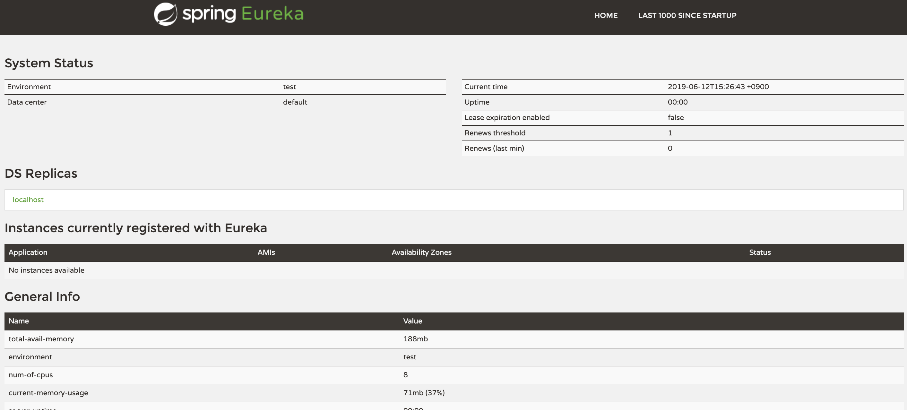
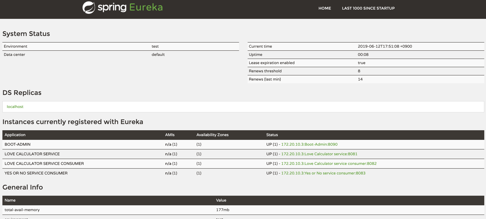
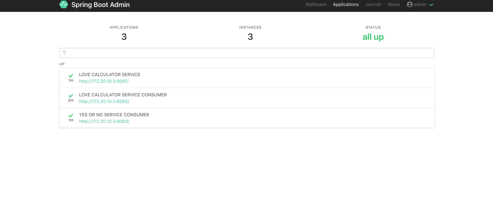

# 실습2: Microservice Monitoring with Service Discovery (Eureka) and Spring Boot Admin

[2019.06.15] Oracle Developer Meetup Spring Boot Microservice Metrics Hands-On Guide

***

### 실습 목표

3개의 Spring Boot 기반 마이크로서비스로 구성된 어플리케이션(Love Calculator)에 대한 매트릭스 정보 모니터링 환경을 위해 다양한 오픈소스 소프트웨어를 활용해서 직접 구축해 봅니다. 두 번째는 Netflix Service Discovery 솔루션인 Eureka와 Spring Boot Admin을 통해 환경을 구성해 봅니다.

***

### Spring Cloud Netflix Eureka 서버 (Spring Boot 프로젝트) 생성 및 구성
spring-admin-server와 마찬가지로 제공된 Eclipse Spring Tool Suite(이하 STS) 프로젝트중에서 eureka-discovery-server가 Service Discovery Server 역할을 합니다.

spring-admin-server와 마찬가지로 제공되는 프로젝트를 활용해도 되지만, 새로 만들어볼 수 있습니다. 새로 프로젝트를 생성해서 Eureka Discovery Server를 구성할 경우 아래 **Eureka Discovery 서버 만들기**를 클릭해서 가이드데로 진행합니다.

<details>
<summary>Eureka Discovery 서버 만들기</summary>
<div markdown="1">

1. STS에서 File > New > Spring Starter Project를 선택 (안보일 경우 Other 클릭 후 검색)


2. Name과 Java Version을 다음과 같이 입력 후 Next > Finish 클릭
* Name
    * eureka-discovery-server-2
* Java Version 
    * 12

3. STS에서 pom.xml에 Dependency 설정을 합니다. 좌측 STS Package Explorer에서 **ureka-discovery-server-2/pom.xml** 파일을 더블 클릭하고 다음과 같이 기존 설정된 내용에 아래 properties, dependencies, dependencyManagement까지의 내용으로 변경하고 저장(Ctrl + s)합니다.
    > Eclipse STS에서 XML에 대한 자동 포맷팅 단축키는 ***'Ctrl + Shift + f'*** 입니다.

    ```xml
    <properties>
        <java.version>12</java.version>
        <spring-cloud.version>Greenwich.RELEASE</spring-cloud.version>
    </properties>

    <dependencies>
        <dependency>
            <groupId>org.springframework.cloud</groupId>
            <artifactId>spring-cloud-starter-netflix-eureka-server</artifactId>
        </dependency>
        
        <dependency>
            <groupId>org.springframework.boot</groupId>
            <artifactId>spring-boot-starter-test</artifactId>
            <scope>test</scope>
        </dependency>

        <dependency>
            <groupId>javax.activation</groupId>
            <artifactId>activation</artifactId>
            <version>1.1.1</version>
        </dependency>

        <dependency>
            <groupId>javax.xml.bind</groupId>
            <artifactId>jaxb-api</artifactId>
            <version>2.3.0</version>
        </dependency>

        <dependency>
            <groupId>com.sun.xml.bind</groupId>
            <artifactId>jaxb-core</artifactId>
            <version>2.3.0</version>
        </dependency>

        <dependency>
            <groupId>com.sun.xml.bind</groupId>
            <artifactId>jaxb-impl</artifactId>
            <version>2.3.0</version>
        </dependency>
    </dependencies>

    <dependencyManagement>
        <dependencies>
            <dependency>
                <groupId>org.springframework.cloud</groupId>
                <artifactId>spring-cloud-dependencies</artifactId>
                <version>${spring-cloud.version}</version>
                <type>pom</type>
                <scope>import</scope>
            </dependency>
        </dependencies>
    </dependencyManagement>
    ```

4. STS에서 Spring Boot Application 파일(eureka-discovery-server-2/src/main/java/com/example/demo/EurekaDiscoveryServer2Application.java)을 열고 다음과 같이 @EnableEurekaServer 을 추가합니다.

    > STS에서 자동 Package Import 단축키는 ***'Ctrl + Shift + o'*** 입니다. Annotation을 추가하고 위 단축키를 눌러서 관련 패키지를 임포트 합니다.

    ```java
    @SpringBootApplication
    @EnableEurekaServer
    public class EurekaDiscoveryServerApplication {

        public static void main(String[] args) {
            SpringApplication.run(EurekaDiscoveryServerApplication.class, args);
        }
    }
    ```

5. STS에서 Spring Boot Properties(eureka-discovery-server-2/src/main/resources/application.properties) 파일에 다음과 같이 추가합니다. 

    ```properties
    spring.application.name=eureka-discovery-server 
    server.port=8761

    # Logging
    logging.level.org.springframework=INFO
    logging.file=./logs/spring-boot-logging.log

    # Eureka
    eureka.client.register-with-eureka=false
    eureka.client.fetch-registry=false
    ```

6. Eureka Server를 시작합니다. Windows Command 또는 Terminal을 열고 다음과 같이 실행합니다.

    ```
    $ cd {ROOT}/sts_workspace/eureka-discovery-server-2

    $ mvn spring-boot:run
    ```

7. Browser에서 http://localhost:8761으로 Eureka Server Console에 접속합니다.  
    

    > 서버 종료는 ***Ctrl + c*** 로 종료합니다.
</div>
</summary>
</details>

### Spring Admin Server 구성
첫 번째 실습에서는 모든 서비스들을 직접 Spring Admin Server에 등록해 연결했습니다. 이번 실습은 모든 서비스들이 Eureka Discovery Server의 Registry에 등록이 되고, Spring Boot Admin이 Eureka를 통해서 서비스들에 대한 Metrics 정보를 얻습니다.  
따라서 Spring Boot 서비스(Love Calculator)와 Spring Boot Admin을 Eureka Client로 등록해서 연결해줘야 합니다.

* **실습 1**
    * Love Calculator 서비스 -> Spring Boot Admin (모니터링 서버)

* **실습 2**
    * Love Calculator 서비스 -> Eureka (Discovery 서버) <- Spring Boot Admin (모니터링 서버)

> 직접 만들고 구성한 Spring Boot Admin과 Eureka 서버를 사용할 경우에는 작업을 해당 프로젝트에서 작업하여야 합니다.

1. STS Package Explorer에서 spring-admin-server/pom.xml을 열고 spring-cloud-starter-netflix-eureka-client Dependency를 추가합니다. 

    ```xml
    ...

        <artifactId>spring-boot-starter-security</artifactId>
    </dependency>

    <dependency>
        <groupId>org.springframework.cloud</groupId>
        <artifactId>spring-cloud-starter-netflix-eureka-client</artifactId>
    </dependency>
    ```

2. STS에서 Spring Boot Application 파일(spring-admin-server/src/main/java/com/example/demo/SpringAdminServerApplication.java)을 열고 다음과 같이 @EnableDiscoveryClient 을 추가합니다. 추가한 후 관련 패키지 임포트를 위해서 ***'Ctrl + Shift + o'*** 를 클릭합니다.

    > STS에서 자동 Package Import 단축키는 ***'Ctrl + Shift + o'*** 입니다. Annotation을 추가하고 위 단축키를 눌러서 관련 패키지를 임포트 합니다.

    ```
    @SpringBootApplication
    @EnableAdminServer
    @EnableDiscoveryClient
    public class SpringAdminServerApplication {

        public static void main(String[] args) {
            SpringApplication.run(SpringAdminServerApplication.class, args);
        }

        @Configuration
        public class SecurityConfig extends WebSecurityConfigurerAdapter {
    ```

3. STS에서 Spring Boot Properties(spring-admin-server/src/main/resources/application.properties) 파일에 다음과 같이 Eureka와 관련된 Property의 주석을 제거합니다.

    ```properties
    spring.application.name=Boot-Admin
    server.port=8090

    # Logging
    logging.level.org.springframework=INFO
    logging.file=./logs/spring-boot-logging.log

    # spring security
    spring.security.user.name=admin
    spring.security.user.password=admin

    # Ignore this sba at eureka
    spring.boot.admin.discovery.ignored-services=boot-admin

    # Eureka
    eureka.client.service-url.defaultZone=http://localhost:8761/eureka/
    eureka.client.registry-fetch-interval-seconds=5
    eureka.client.register-with-eureka=true
    eureka.client.fetch-registry=true
    eureka.instance.lease-renewal-interval-in-seconds=10
    eureka.instance.metadata-map.startup=${random.int}
    ```

    > 각 Property에 대한 자세한 설명은 다음 블로그를 참조하세요.  
    > https://mangdan.github.io/spring-boot-microservice-monitoring-2/


### Love Calculator 서비스 수정
Spring Boot Admin이 아닌 Eureka Server와 연결되도록 설정을 변경합니다.

마찬가지로 3개 서비스(love-calculator-service, love-calculator-cconsumer, yes-or-no-consumer)에 대한 설정이 동일합니다. 여기서는 love-calculator-service를 예로 진행합니다. (3개 서비스 모두 적용)

1. STS에서 love-calculator-service/pom.xml을 열고 spring-boot-admin-starter-client dependency를 다음과 같이 spring-cloud-starter-netflix-eureka-client로 변경합니다.

    **변경 전**
    ```xml
    <dependency>
        <groupId>de.codecentric</groupId>
        <artifactId>spring-boot-admin-starter-client</artifactId>
    </dependency>
    ```

    **변경 후**
    ```xml
    <dependency>
        <groupId>org.springframework.cloud</groupId>
        <artifactId>spring-cloud-starter-netflix-eureka-client</artifactId>
    </dependency>
    ```

2. STS에서 Spring Boot Application 파일(love-calculator-service/src/main/java/com/example/demo.LoveCalculatorServiceApplication.java)을 열고 다음과 같이 @EnableDiscoveryClient 어노테이션을 추가합니다.

    어노테이션을 추가하고 ***'Ctrl + Shift + o'*** 을 눌러서 관련 패키지를 임포트합니다.

    ```java
    @SpringBootApplication
    @EnableDiscoveryClient
    public class LoveCalculatorServiceApplication {

        public static void main(String[] args) {
            SpringApplication.run(LoveCalculatorServiceApplication.class, args);
            
            // for kill the app Process (강제로 서버 중지를 위해 pid 포함된 파일 생성)
            SpringApplicationBuilder app = new SpringApplicationBuilder(LoveCalculatorServiceApplication.class)
                    .web(WebApplicationType.NONE);
            app.build().addListeners(new ApplicationPidFileWriter("./love-calculator-service/shutdown.pid"));
            app.run();
        }
    }
    ```

3. STS에서 Spring Boot Properties(love-calculator-service/src/main/resources/application.properties) 파일에 다음과 같이 Spring Boot Admin 관련 Property는 주석 처리하고 Eureka와 관련된 부분은 주석을 제거합니다.

    ```properties
    spring.application.name=Love Calculator service
    server.port=8081

    # Logging
    logging.level.org.springframework=INFO
    logging.file=./logs/spring-boot-logging.log

    # Actuator
    management.endpoints.web.exposure.include=*

    # Spring Boot Admin
    #spring.boot.admin.client.url=http://localhost:8090
    #spring.boot.admin.client.username=admin
    #spring.boot.admin.client.password=admin

    # Eureka
    eureka.client.service-url.defaultZone: http://localhost:8761/eureka

    # Consul
    #spring.cloud.consul.host=localhost
    #spring.cloud.consul.port=8500
    ```

4. 동일하게 나머지 두개의 서비스 (love-calculator-consumer, yes-or-no-consumer)도 동일하게 적용합니다.

### 모든 서비스와 서버 시작 및 Spring Boot Admin 모니터링 대시보드 확인
> 직접 만들고 구성한 Spring Boot Admin과 Eureka 서버를 사용할 경우에는 작업을 해당 프로젝트에서 작업하여야 합니다.

* ***Eureka 서버 시작***
    ```
    $ cd {ROOT}/sts_workspace/eureka-discovery-server

    $ mvn spring-boot:run
    ```

* ***Spring Admin 서버 시작***
    ```
    $ cd {ROOT}/sts_workspace/spring-admin-server

    $ mvn spring-boot:run
    ```

* ***Love Calculator 서비스 시작***
    
    **Windows**
    ```
    $ cd {ROOT}/sts_workspace

    $ start_all_svc.cmd
    ```

    **macOS**
    ```
    $ cd {ROOT}/sts_workspace

    $ ./start_all_svc.sh
    ```

* ***Eureka 서버 대시보드***


* ***Spring Boot Admin 서버 대시보드***


### 모든 서비스 중지
다음 실습을 위해서 모든 서비스를 중지합니다.

* **Windows**
    Spring Boot Admin과 Eureka 서버는 ***'Ctrl + c'***로 중지하고, Love Calculator의 경우는 서비스를 시작한 커맨드창을 닫으면 모두 중지됩니다.

* **macOS** 
    마찬가지로 Spring Boot Admin과 Eureka 서버는 ***'Ctrl + c'***로 중지하고, Love Calculator 서비스는 다음 스크립트로 모두 중지합니다.

    ```
    cd {ROOT}\sts_workspace

    ./stop_all_svc.sh
    ```

***

* [실습3: Microservice Monitoring with Service Discovery(Consul) Prometheus and Grafana](HOL-PART3.md)

* [첫 페이지로 가기](README.md)

***

### 참고
본 실습 관련 좀 더 상세한 내용은 아래 블로그 참고하세요.
* https://mangdan.github.io/spring-boot-microservice-monitoring-2/