# 실습3: Microservice Monitoring with Service Discovery (Consul) and Prometheus, Grafana

[2019.06.15] Oracle Developer Meetup Spring Boot Microservice Metrics Hands-On Guide

***

### 실습 목표

3개의 Spring Boot 기반 마이크로서비스로 구성된 어플리케이션(Love Calculator)에 대한 매트릭스 정보 모니터링 환경을 위해 다양한 오픈소스 소프트웨어를 활용해서 직접 구축해 봅니다. 세 번째는 Service Discovery솔루션인 Hashicorp사의 Consul과 Prometheus+Grafana 조합을 통해 환경을 구성해 봅니다.

***

### Consul 실행
Service Discovery 오픈소스중에서 요즘 많이 사용되고 있는 HashiCorp의 Consul을 사용합니다. 

> 현재 시계열 데이터 모니터링을 수행하는 오픈소스 모니터링 솔루션인 Prometheus는 현재 공식적으로 Eureka에 대한 Prometheus Exporter를 지원하지 않기 때문에 현재 공식 지원하는 Consul을 통해서 Prometheus와 연동합니다.

1. 실습을 위해 제공된 Consul Server Agent를 Windows Command 혹은 Terminal에서 실행합니다.
    > **Consul Agent**  
    > Consul Agent는 Server와 Client 두가지 모드를 지원하는데, 하나의 데이터센터는 최소한 하나의 Server Agent가 필요합니다. 하나의 Cluster 에는 하나의 Server Agent와 함께 다수의 Client Agent(선택)가 있고, Server Agent가 Client Agent를 관리합니다. 여기에 Consul UI를 위한 서버가 필요합니다. Consul 홈페이지에서는 하나의 Cluster에 Server Agent, Client Agent, Web UI까지 최소 3개의 서버를 권장하고 있습니다. 물론 Web UI의 경우는 Server Agent에 같이 구성할 수 있으며, Client Agent 없이 Server Agent 단일 노드로 구성도 가능합니다

* **Windows**
    ```
    $ cd {ROOT}\consul-1.5.1

    $ consul.exe agent -dev -ui
    ```

* **macOS**
    ```
    $ cd {ROOT}/consul-1.5.1

    $ consul agent -dev -ui
    ```

    > **-dev -ui 옵션**  
    > 개발 환경에서 단일 노드로 Consul을 시작하고자 할 때 -dev 옵션을 사용할 수 있습니다. -dev 옵션을 사용하면 모든 정보가 메모리에 저장되고, 빠르게 시작할 수 있습니다. -ui 옵션은 Consul Web UI 서버가 같이 시작합니다. 추가적인 Agent 관련 옵션은 아래 페이지를 참고합니다.
    https://www.consul.io/docs/agent/options.html

2. http://localhost:8500/ui 로 접속하면 다음과 같이 Consul Web UI를 확인할 수 있습니다. 
    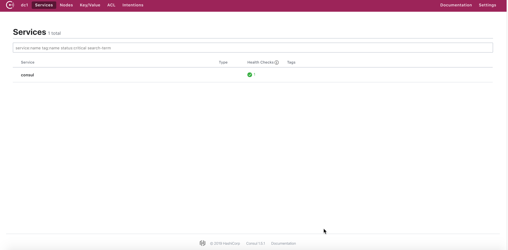

### Spring Boot 서비스(Love Calculator) Consul 설정
앞서 Spring Boot 서비스를 Eureka에 등록하는 것을 실습했습니다. 이번에는 Consul에 등록해 보도록 하겠습니다. 마찬가지로 3개의 서비스(love-calculator-service, love-calculator-consumer, yes-or-no-consumer) 모두 설정 과정이 동일하며, 여기서는 love-calculator-service를 기준으로 설명합니다.

1. STS에서 love-calculator-service/pom.xml을 열고 spring-cloud-starter-netflix-eureka-client dependency를 다음과 같이 spring-cloud-starter-consul-discovery로 변경합니다. 추가적으로 Prometheus를 위한 Micrometer Registry에 대한 Dependency를 추가합니다.

    ```xml
    변경 전
    <dependency>
        <groupId>org.springframework.cloud</groupId>
        <artifactId>spring-cloud-starter-netflix-eureka-client</artifactId>
    </dependency>
    ```

    ```xml
    변경 후
    <dependency>
        <groupId>org.springframework.cloud</groupId>
        <artifactId>spring-cloud-starter-consul-discovery</artifactId>
    </dependency>

    <dependency>
        <groupId>io.micrometer</groupId>
        <artifactId>micrometer-registry-prometheus</artifactId>
    </dependency>
    ```

    <details>
    <summary>여기서 잠깐!!! Micrometer란 무엇인가요?</summary>
    <div markdown="1">

    Spring Boot 2 부터는 Spring Boot Actuator에 Micrometer Core가 기본 포함됩니다. Micrometer가 무엇이냐~ 일단, Mirometer 홈페이지(https://micrometer.io)에 가보면 커다랗게 다음과 같이 소개하는 문장이 눈에 들어옵니다.
    
    ***Vendor-neutral application metrics facade***

    대략 벤더 중립 애플리케이션 메트릭 퍼사드인데, 퍼사드는 일종의 특정 소프트웨어를 사용하기 위한 인터페이스 객체정도로 생각하면 됩니다. Micrometer를 사용하면 다양한 모니터링 시스템과 연동을 할 수 있습니다. 이렇게 하는 이유는 Spring Boot Actuator가 제공하는 정보는 json 혹은 plain text 형태로 사람이 직관적으로 전체를 한눈에 이해하기가 쉽지 않기 때문에 그래피컬하게 모니터링하기 위한 솔루션들을 붙여야 하는데, 이 Micrometer가 이러한 솔루션들을 연결해주는 다리 역할을 한다고 보면 됩니다.
    홈페이지에서 Micrometer를 Think SLF4J, but for metrics. 이라고 소개하고 있습니다. 다양한 로깅 구현체들을 추상화해서 인터페이스를 제공하는 SLF4J와 비슷한건데, 로깅이 아닌 메트릭을 위한 것이 바로 Micrometer입니다.
    </div>
    </summary>
    </details>

2. STS에서 Spring Boot Properties(love-calculator-service/src/main/resources/application.properties) 파일에 다음과 같이 Eureka 관련 Property는 주석 처리하고 Consul과 관련된 부분은 주석을 제거합니다.

    ```properties
    spring.application.name=Love Calculator service
    server.port=8081

    # Logging
    logging.level.org.springframework=INFO
    logging.file=./logs/spring-boot-logging.log

    # Actuator
    management.endpoints.web.exposure.include=*

    # Spring Boot Admin
    #spring.boot.admin.client.url=http://localhost:8090
    #spring.boot.admin.client.username=admin
    #spring.boot.admin.client.password=admin

    # Eureka
    #eureka.client.service-url.defaultZone: http://localhost:8761/eureka

    # Consul
    spring.cloud.consul.host=localhost
    spring.cloud.consul.port=8500
    ```

3. STS에서 Spring Boot Application 파일(love-calculator-service/src/main/java/com/example/demo.LoveCalculatorServiceApplication.java)을 열고 다음과 같이 @EnableDiscoveryClient 어노테이션을 추가합니다.

    **이 부분은 두 번째 실습에서 이미 설정했기 때문에 건너뜁니다.**

4. 동일하게 나머지 두개의 서비스 (love-calculator-consumer, yes-or-no-consumer)도 동일하게 적용합니다.

### Spring Boot 서비스(Love Calculator) 시작 및 Consul 서비스 목록 확인

* ***Love Calculator 서비스 시작***
    
    **Windows**
    ```
    $ cd {ROOT}\sts_workspace

    $ start_all_svc.cmd
    ```

    **macOS**
    ```
    $ cd {ROOT}/sts_workspace

    $ ./start_all_svc.sh
    ```

* ***Consul 서비스 목록***  
    http://localhost:8500/ui
    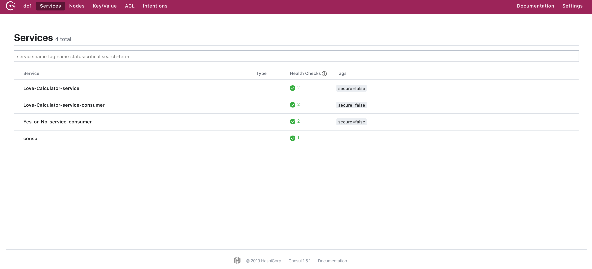

### Prometheus 설정 및 시작
시계열 데이터 모니터링을 수행하는 오픈소스 모니터링 솔루션인 Prometheus에서 Consul Exporter를 활용해 연동해보겠습니다.

1. 먼저 {ROOT}/prometheus-2.10.0/prometheus.yml 파일을 에디터로 열어서 내용을 확인합니다.
    > Prometheus에서 Consul과 같은 Discovery 솔루션을 사용하지 않고 직접 서비스들과 연동할 경우 static_configs 하위 targets 부분에 배열로 모니터링 할 대상을 직접 입력해 줍니다.

    ```yml
    global:
      scrape_interval:     15s

    scrape_configs:
      - job_name: love-calculator-service
        metrics_path: '/actuator/prometheus'
    #    static_configs:
    #      - targets: ['localhost:8081', 'localhost:8082', 'localhost:8083']
        consul_sd_configs:
          - server: 'localhost:8500'
        relabel_configs:
          - source_labels: [__meta_consul_tags]
            action: keep
          - source_labels: [__meta_consul_service]
            target_label: job
    ```

2. 실습을 위해 제공된 Prometheus 서버를 시작합니다.

* ***Windows***  
    ```
    $ cd {ROOT}\prometheus-2.10.0

    $ prometheus.exe --config.file=prometheus.yml
    ```

* ***macOS***  
    ```
    $ cd {ROOT}/prometheus-2.10.0

    $ prometheus --config.file=prometheus.yml
    ```
* ***Prometheus Web UI***  
    http://localhost:9090
    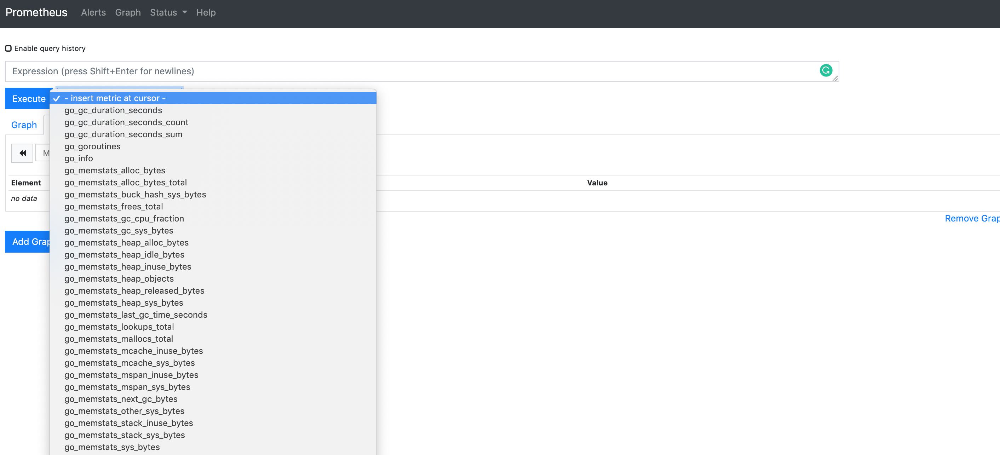
    > **- insert metric at cursor**를 선택했을 때 위 이미지와 같이 관련 Metrics가 보이면 정상입니다.

### Grafana 시작 및 대시보드 구성
Prometheus는 각 서비스들로 부터 가져온 Metrics 데이터를 시계열 데이터베이스에 저장한 후 이를 Prometheus에서 제공하는 그래프 차트를 통해 표현해줍니다. 하지만 제공되는 차트가 단순하기 때문에 일반적으로 Prometheus와 연동 가능한 대시보드 솔루션을 활용 합니다. Grafana는 데이터소스로서 Prometheus와 같은 다양한 솔루션들과의 연동을 통해 훌륭한 대시보드를 구성할 수 있도록 도와주는 오픈소스 데이터 시각화 솔루션입니다.

1. 실습을 위해 제공된 Grafana 서버를 Windows Command 혹은 Terminal에서 실행하고 Grafana Web Dashboard에 로그인합니다.

* ***Windows***  
    ```
    $ cd {ROOT}\grafana-6.2.2\bin

    $ grafana-server.exe
    ```

* ***macOS***  
    ```
    $ cd {ROOT}\grafana-6.2.2\bin

    $ grafana-server
    ```
* ***Grafana Web UI***  
    http://localhost:3000 (id/pw: admin/admin)  
    > 처음에 패스워드 변경하라고 나오는데, skip 클릭하면 변경 없이 로그인 됩니다.

    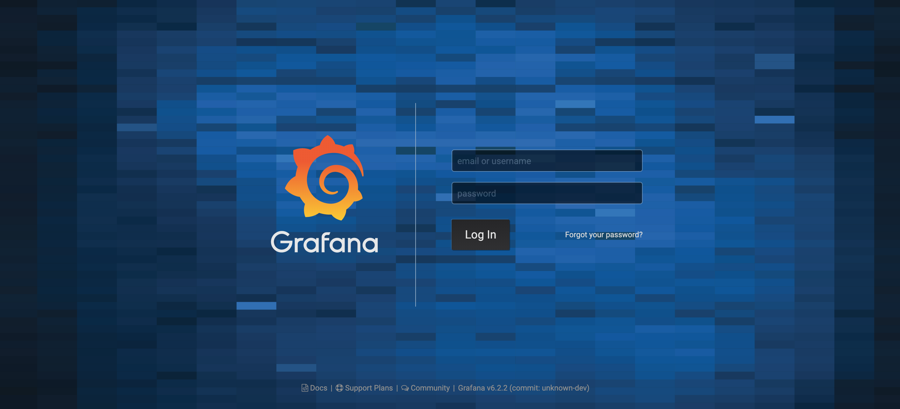
    
    **Grafana Home**
    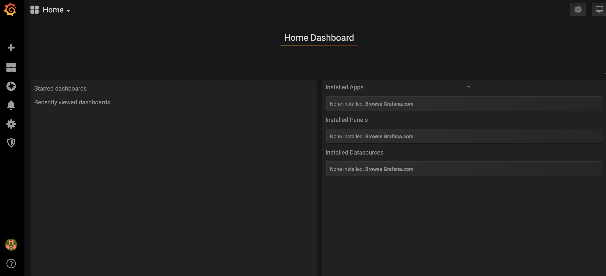
    
2. Grafana의 데이터소스를 Prometheus로 설정합니다. 좌측 Configuration 버튼 클릭 후 Data Sources를 선택한 후 "Add data source"를 클릭 합니다. Prometheus 선택 후 URL에 http://localhost:9090 입력 후 **Save & Test**를 클릭합니다.

    **Configuration > Data Sources**  
    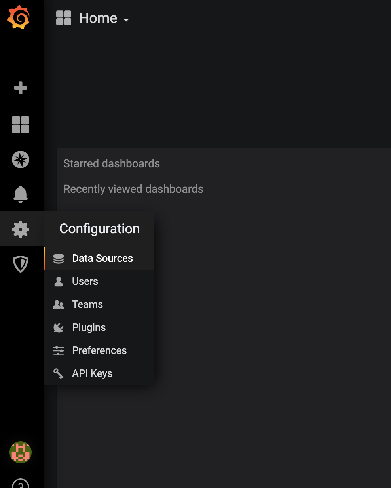

    **Add data source 클릭**  
    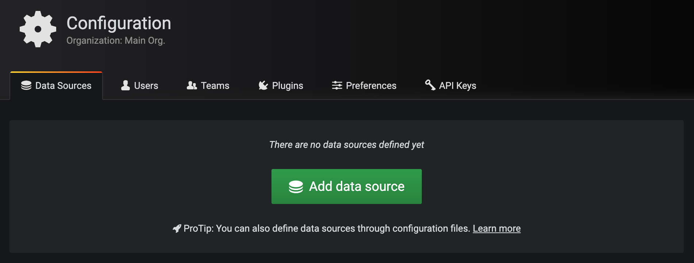

    **Prometheus 선택**  
    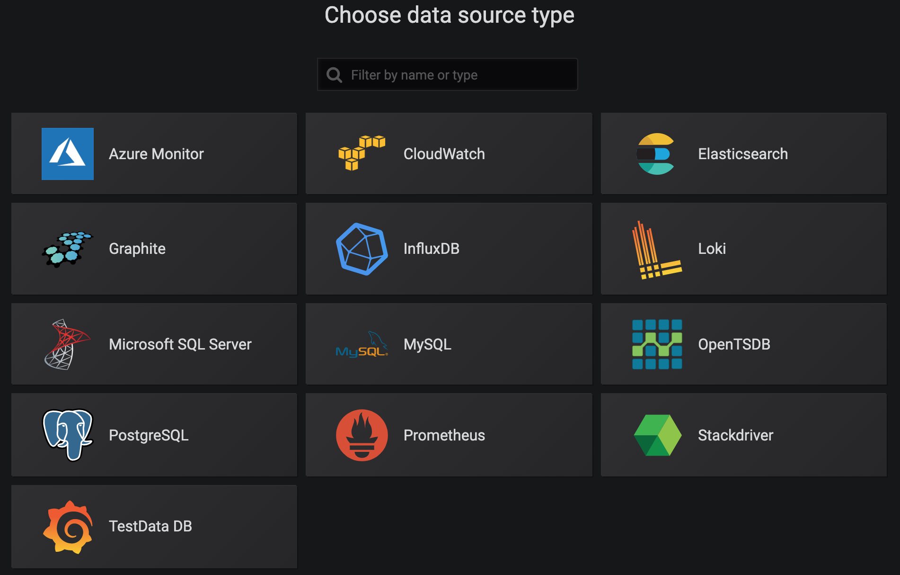

    **Prometheus 설정 및 저장, 테스트**  
    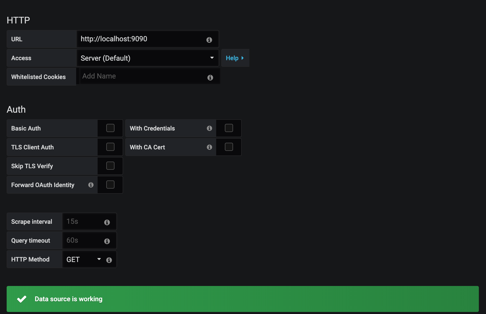

3. Grafana에는 사용자들이 직접 대시보드를 만들어서 공유를 하는 공간이 있습니다. 대시보드를 처음부터 구성해도 되겠지만, 여기서는 Spring Boot와 Micrometer 관련 대시보드중에서 평점이 좋은 대시보드 하나를 임포트해서 사용하겠습니다. Grafana Dashboards(https://grafana.com/dashboards)에 가면 Grafana에서 공식적으로 제공하는 대시보드와 사용자 대시보드를 조회할 수 있습니다. 이중에서 가장 평점이 높은 JVM(Micrometer)를 임포트 하겠습니다.

    **JVM(Micrometer) Dashboard**  
    Micrometer로 조회해서 리스트에 나온 JVM(Micrometer)를 선택 
    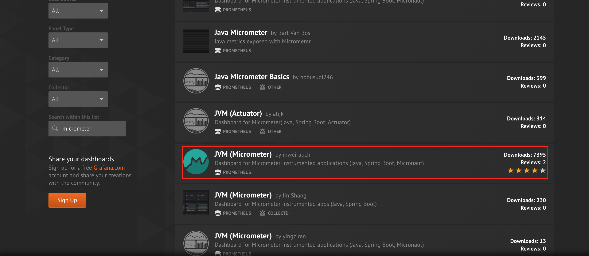

    우측 Dashboard ID 확인 (4701)
    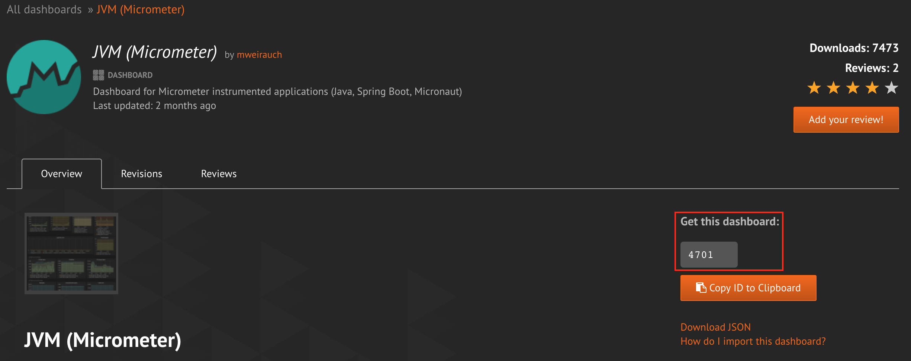
    
    Micrometer Dashboard 관련 common tag 설정 방법 가이드
    

    여기서 주의할 사항은 임포트 할 대시보드가 Micrometer를 활용하도록 구성이 되어 있습니다. 해당 대시보드에 대한 설명글을 보면 Micrometer의 common tag를 활용하는 부분이 있습니다. 대시보드에서는 Prometheus에서 수집하는 다수의 서비스들을 모니터링 해야 합니다. 여기서 이 다수의 서비스들을 모니터링 하기 위해 tag를 붙일 수 있는데 각 서비스 Application에 Bean을 등록해주면 됩니다.

    **Micrometer Tag 설정**  
    위 가이드에 따라 3개 서비스 프로젝트 (love-calculator-service, love-calculator-consumer, yes-or-no-consumer)의 src/main/java/com/example/demo/~Application.java파일의 main 함수 다음에 Micrometer의 commonTags를 사용하는 Bean을 추가.
    ```java
    public static void main(String[] args) {
		SpringApplication.run(LoveCalculatorServiceApplication.class, args);
		
		// for kill the app Process (강제로 서버 중지를 위해 pid 포함된 파일 생성)
		SpringApplicationBuilder app = new SpringApplicationBuilder(LoveCalculatorServiceApplication.class)
				.web(WebApplicationType.NONE);
		app.build().addListeners(new ApplicationPidFileWriter("./love-calculator-service/shutdown.pid"));
		app.run();
	}
	
	@Bean
	MeterRegistryCustomizer<MeterRegistry> configurer(
	    @Value("${spring.application.name}") String applicationName) {
	    return (registry) -> registry.config().commonTags("application", applicationName);
	}
    ```

    > STS에서 자동 Package Import 단축키는 ***'Ctrl + Shift + o'***입니다. Bean 추가 후 패키지 임포트가 안되서 오류가 발생하면, 위 단축키를 눌러서 관련 패키지를 임포트합니다.

    > Spring Boot 서비스는 자동으로 재시작 합니다. 각 서비스의 Dependency에 spring-boot-devtools이 포함되어 있는데, 소스가 변경된 것을 감지하고 자동으로 재시작 해주는 역할을 합니다.

    **Dashboard 가져오기**  
    Grafana 화면 좌측 **+** 버튼을 클릭한 후 **Import**를 선택, **Grafana.com Dashboard**에 가져올 Dashboard의 ID(4701)를 입력합니다.
    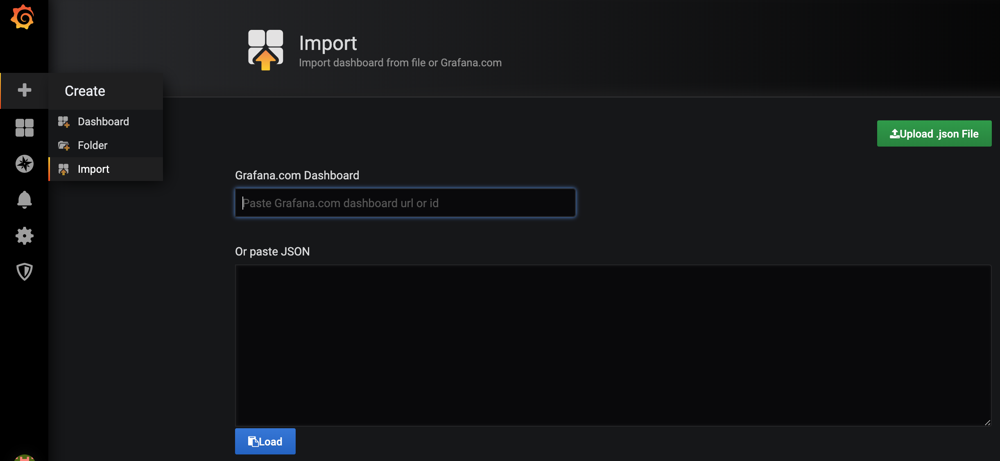
    
    맨 아래 Prometheus에서 Prometheus를 선택한 후 Import 버튼을 클릭합니다.
    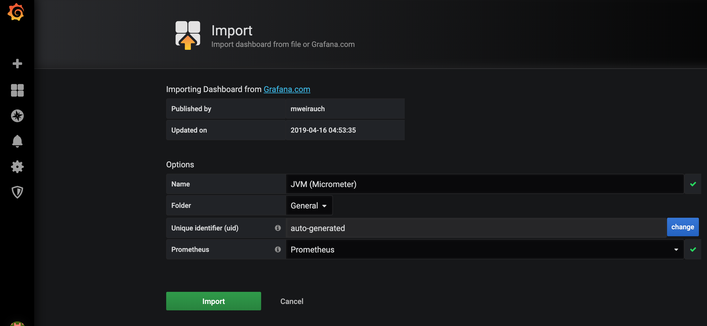

### Grafana Micrometer Dashboard with Spring Boot Microservices
최종 모습입니다.

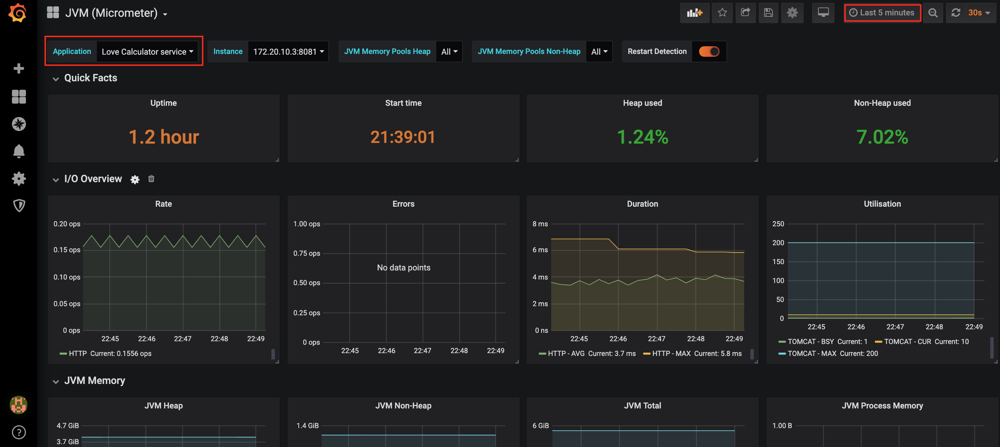

***

- [첫 페이지로 가기](README.md)

***

### 참고
본 실습 관련 좀 더 상세한 내용은 아래 블로그 참고하세요.
* https://mangdan.github.io/spring-boot-microservice-monitoring-3/
* https://mangdan.github.io/spring-boot-microservice-monitoring-4/