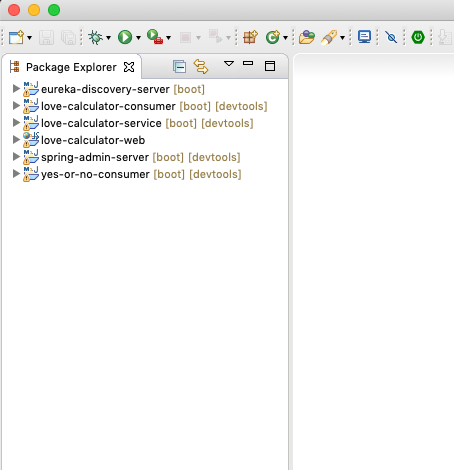
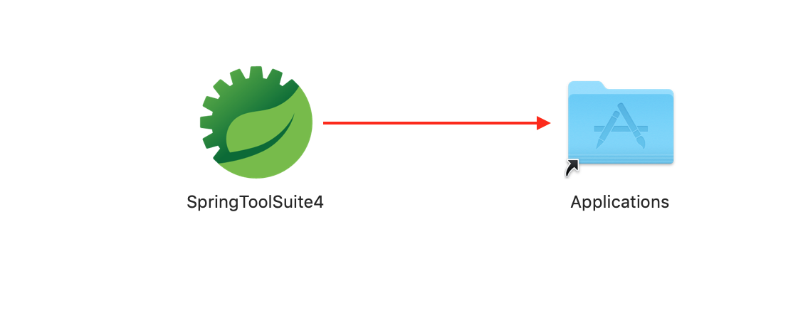
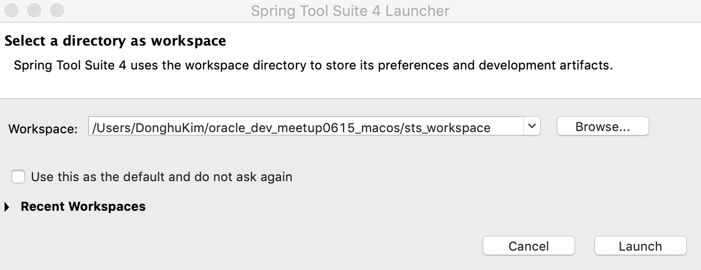
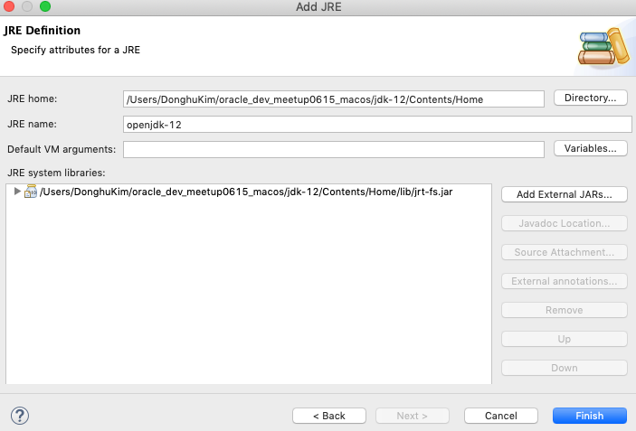
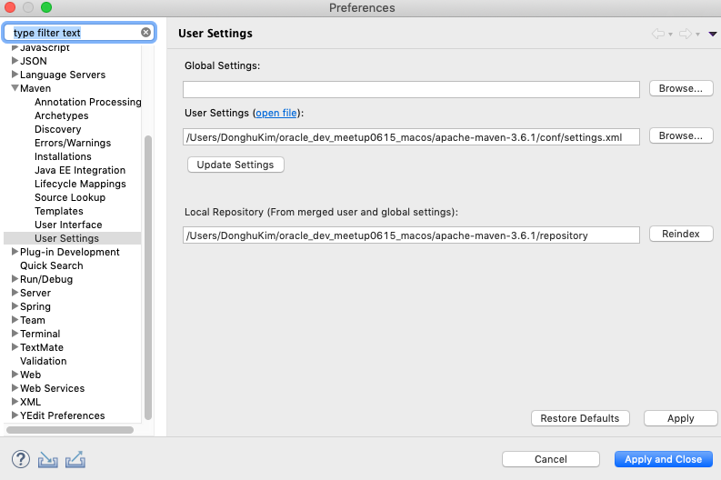
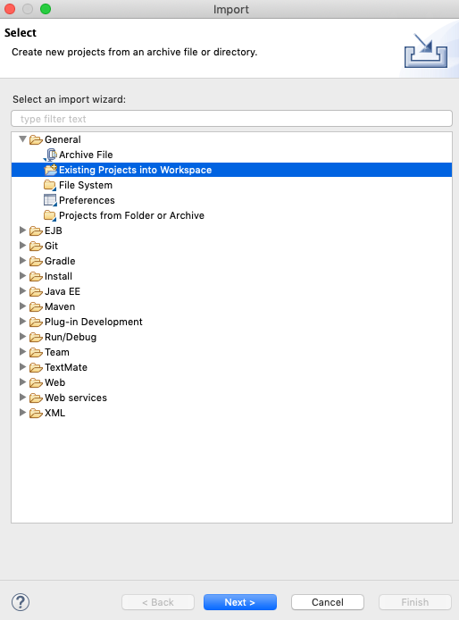
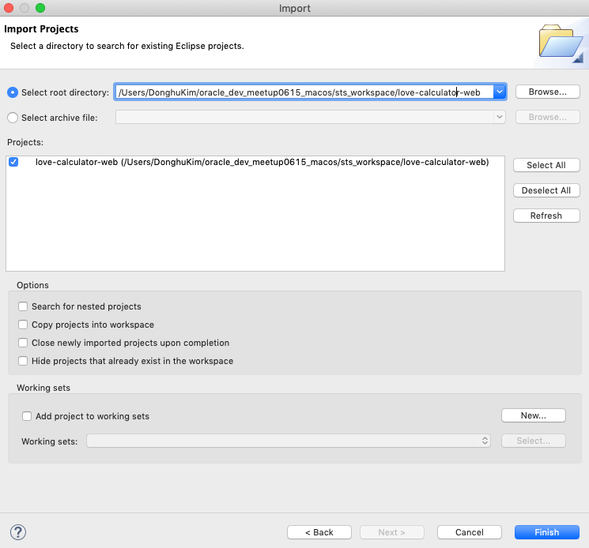
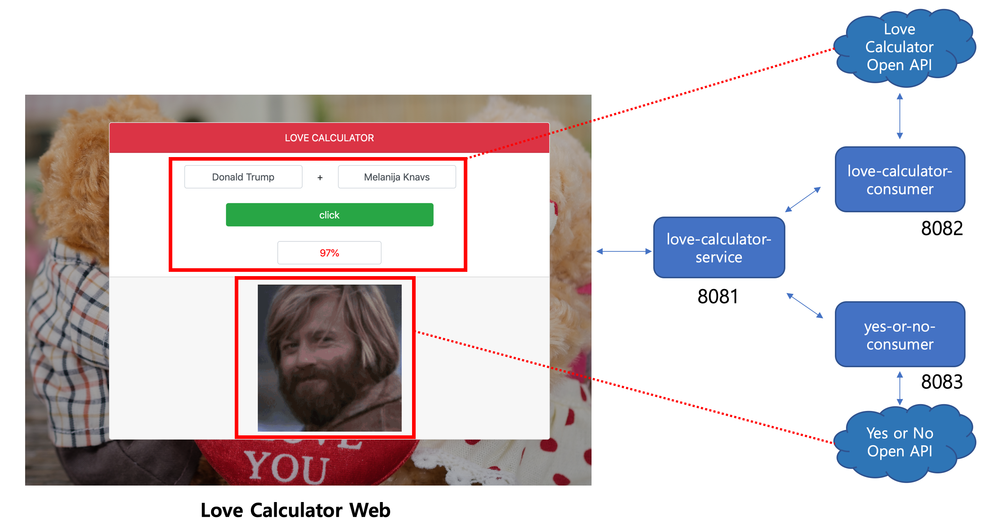

# Spring-Boot: Microservice Metrics Monitoring Hands-On

[2019.06.15] Oracle Developer Meetup Spring Boot Microservice Metrics Hands-On Guide

***

### 실습 목표

3개의 Spring Boot 기반 마이크로서비스로 구성된 어플리케이션(Love Calculator)에 대한 매트릭스 정보 모니터링 환경을 위해 다양한 오픈소스 소프트웨어를 활용해서 직접 구축해 봅니다.

### 실습을 위해 필요한 소프트웨어
* [Spring Tools 4 for Eclipse](https://spring.io/tools)
* [OpenJDK 12.0.1](https://jdk.java.net/12/)
* [Apache Maven 3.6.1](https://maven.apache.org/download.cgi)
* [Prometheus 2.10.0](https://prometheus.io/download/)
* [Grafana 6.2.2](https://grafana.com/grafana/download)

### 전체 프로그램 및 예제 소스 다운로드
* Windows 사용자
    https://objectstorage.ap-seoul-1.oraclecloud.com/p/h6lUWYH0x8XEmgCRTzhsjThYNE34dPQ-nRzrIGL20fw/n/apackrsct01/b/bucket-20190614-1639/o/oracle_dev_meetup0615_windows.zip
* macOS 사용자
    https://objectstorage.ap-seoul-1.oraclecloud.com/p/8LwxuQs9C_Gywv04nTw8OvUa_bEgTJ4n8wYa9Ees4s8/n/apackrsct01/b/bucket-20190614-1639/o/oracle_dev_meetup0615_macos.zip

### 설치 및 환경 구성
#### Windows
1. Windows 사용자의 경우는 Eclipse STS에 OpenJDK, Maven 구성 및 프로젝트 임포트 된 구성으로 배포했기 때문에 STS에 추가적으로 설정할 부분은 없습니다. C: 드라이브에 다음과 같이 압축 해제합니다.
    ```
    c:\oracle_dev_meetup0615_windows\apache-maven-3.6.1
    c:\oracle_dev_meetup0615_windows\consul-1.5.1
    c:\oracle_dev_meetup0615_windows\grafana-6.2.2
    c:\oracle_dev_meetup0615_windows\jdk-12
    c:\oracle_dev_meetup0615_windows\prometheus-2.10.0
    c:\oracle_dev_meetup0615_windows\sts_workspace
    c:\oracle_dev_meetup0615_windows\sts-4.2.2.RELEASE
    ```

2. OpenJDK, Maven, Prometheus, Grafana, Consul의 Path 설정을 합니다.  
Windows Command Line에서 아래와 같이 실행합니다.
    ```
    setx path "%PATH%;c:\oracle_dev_meetup0615_windows\jdk-12\bin;c:\oracle_dev_meetup0615_windows\apache-maven-3.6.1\bin;
    ```

3. sts-4.2.2.RELEASE\SpringToolSuite4.exe파일을 더블클릭해서 Eclipse STS를 실행합니다.  
좌측 Project Explorer에 정상적으로 6개의 Spring Boot Project가 오류없이 보이는지 확인합니다.
    * Love Calculator라는 어플리케이션을 구성하는 서비스와 UI
        * love-calculator-service (Spring Boot Project)
        * love-calculator-consumer (Spring Boot Project)
        * yes-or-no-consumer (Spring Boot Project)
        * love-calculator-web (Static Web, HTML)

    * Spring Boot Admin Server (Monitoring Server)
        * spring-admin-server (Spring Boot Project)

    * Eureka Discovery Server (Service Discovery Server)
        * eureka-discovery-server (Spring Boot Project)

    

> 모니터링 서버인 Spring Boot Admin과 서비스 디스커버리 역할을 하는 Eureka Server는 모두 Spring Boot 기반으로 생성됩니다. 실습 과정에서 제공되는 프로젝트를 그대로 활용하거나, 직접 만들어 볼수도 있습니다.

#### macOS
1. macOS의 경우는 Ecipse STS가 dmg 이미지로 제공되기 때문에 설치 후 STS 설정이 필요합니다.  다운로드 받은 파일을 특정 위치(예시: /Users/DonghuKim/oracle_dev_meetup0615_macos)에 압축 해제한 후 **spring-tool-suite-4-4.2.2.RELEASE-e4.11.0-macosx.cocoa.x86_64.dmg** 파일을 더블 클릭해서 Applications 폴더로 이동합니다.

    

2. OpenJDK, Maven, Prometheus, Grafana, Consul의 Path 설정을 합니다.  
.bash_profile에 환경 변수 및 Path를 설정합니다.

    ```
    $ vi ~/.bash_profile
    ```

    .bash_profile에 다음 내용을 추가합니다. 아래 경로는 예시입니다. 압축 해제한 경로로 변경하여야 합니다.
    ```
    export JAVA_HOME=/Users/DonghuKim/oracle_dev_meetup0615_macos/jdk-12/Contents/Home
    export MAVEN_HOME=/Users/DonghuKim/oracle_dev_meetup0615_macos/apache-maven-3.6.1

    PATH=${PATH}:$JAVA_HOME/bin:$MAVEN_HOME/bin
    export PATH
    ```

3. $MAVEN_HOME/conf/settings.xml 파일을 열어서 Local Maven Repository를 다음과 같이 지정합니다. 아래 경로는 예시이며, 압축 해제한 위치로 변경합니다.
    ```xml
    <localRepository>/Users/DonghuKim/oracle_dev_meetup0615_macos/apache-maven-3.6.1/repository</localRepository>
    ```

4. Launchpad 에서 STS를 실행합니다. workspace는 압축 해제한 폴더의 sts_workspace를 선택합니다.
    

5. Eclipse STS의 Preferences를 열어서 Java > Installed JREs 선택 후 다음과 같이 입력하고 finish 버튼을 클릭 후, 설정한 JRE 체크 후 Apply and Close 버튼을 클릭합니다. 아래 경로는 예시이며, 압축 해제한 위치로 변경합니다.
* JRE home
    * /Users/DonghuKim/oracle_dev_meetup0615_macos/jdk-12/Contents/Home
* JRE name
    * openjdk-12

    

6. Preferences에서 Maven > User Settings 선택 후 다음과 같이 입력하고 Apply and Close 버튼을 클릭합니다.
* User Settings
    * /Users/DonghuKim/oracle_dev_meetup0615_macos/apache-maven-3.6.1/conf/settings.xml

    

7. 예제 Spring Boot 프로젝트를 임포트합니다. File > Import 클릭 후 General > Existing  Projects into Workspace를 선택합니다.  
      

    sts_workspace 폴더내의 eureka-discovery-server 프로젝트를 포함해서 총 6개의 프로젝트(eureka-discovery-server, love-calculator-consumer, love-calculator-web, spring-admin-server, yes-or-no-consumer)를 임포트 합니다.  
    

    Import를 하게 되면 Build와 함께 Dependency 라이브러리를 Maven Local Repository에 저장합니다. 빌드가 성공하면 아래와 같이 오류 없이 정상적으로 임포트가 완료됩니다.  
    

> 편의상 oracle_dev_meetup0615_windows 폴더와 oracle_dev_meetup0615_macos 폴더를 {ROOT}로 표기하겠습니다.

### 실습을 위한 마이크로서비스

<details>
<summary>예제 마이크로 서비스 애플리케이션 설명</summary>
<div markdown="1">

예제로 사용할 마이크로 서비스 애플리케이션은 Love Calculator 애플리케이션입니다. Love Calculator 애플리케이션은 주어진 두 사람의 이름으로 두 사람간의 관계를 비율과 이미지로 표시해주는 애플리케이션입니다. 총 3개의 마이크로 서비스와 하나의 UI 애플리케이션으로 구성되며, 두개의 오픈 API를 사용합니다.



Love Calculator와 Yes or No라는 Open API를 각각 호출하는 두개의 Spring Boot REST Client(love-calculator-consumer, yes-or-no-consumer)가 있습니다. love-calculator-service(8081)는 love-calculator-consumer(8082)를 호출한 후, 결과를 받아서 다시 관련 이미지를 얻기 위해서 yes-or-no-consumer 서비스를 호출합니다. 그리고 두 결과를 합쳐서 결과를 전달하는 서비스입니다.

</div>
</details>

#### Lova Calculator 서비스 실행 및 애플리케이션 테스트

각 서비스 폴더안에서 mvn 혹은 java -jar 명령어로 실행 가능하지만, 편의상 스크립트를 사용합니다. 3개의 Spring Boot 서비스를 시작합니다.  

* **Windows에서 Love Calculator 서비스 시작 (CMD에서 실행)**
    ```
    cd {ROOT}\sts_workspace

    start-all-svc.cmd
    ```

* **macOS에서 Love Calculator 서비스 시작**
    ```
    $ cd {ROOT}/sts_workspace

    $ ./start-all-svc.sh
    ```

* **Love Calculator UI 시작**  
{ROOT}/sts_workspace/love-calculator-web/WebContent/index.html 파일을 탐색기에서 Browser로 오픈합니다. (크롬 브라우저 추천)  
**Your Name**과 **Love Name**을 입력하고 **click** 버튼을 클릭한 후 결과가 잘 나오는지 확인합니다. 
    > 오픈 API에서 가끔 **500null** 오류를 반환하는데, 몇번 다시 클릭하면 정상적인 응답을 받을 수 있습니다.

    

#### 서비스 종료
실습 진행을 위해 서비스를 종료합니다.  

* **Windows에서 Love Calculator 서비스 종료**  
오픈된 커맨드 창을 닫으면 서비스가 종료됩니다.

* **macOS에서 Love Calculator 서비스 종료**  
    ```
    $ cd {ROOT}/sts_workspace

    $ ./stop-all-svc.sh
    ```

이제 실습을 위한 기본 준비가 끝났습니다. 총 3개의 Spring Boot 서비스 모니터링 환경 구성 시나리오를 가지고 진행합니다. 아래 링크를 클릭해서 각 실습 페이지로 이동해서 실습을 진행합니다.

- [실습1: Microservice Monitoring with Spring Boot Admin](HOL-PART1.md)

- [실습2: Microservice Monitoring with Service Discovery (Eureka) and Spring Boot Admin](HOL-PART2.md)

- [실습3: Microservice Monitoring with Service Discovery (Consul) and Prometheus, Grafana](HOL-PART3.md)